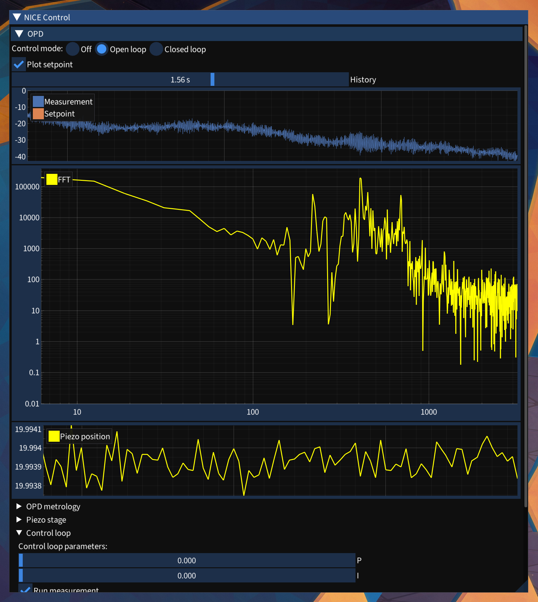

# NICEcontrol

NICEcontrol is a program to monitor and control the [Nulling Interferometry Cryogenic Experiment (NICE)](https://quanz-group.ethz.ch/research/instrumentation/nice.html).

This nulling testbed, built at ETH Zürich by the [Exoplanets & Habitability group](https://quanz-group.ethz.ch/), will demonstrate the feasibility of the [LIFE space mission](https://life-space-mission.com/).



## Install

1. Install prerequisites
   * macOS (untested)

     ```bash
     brew install glfw fftw
     ```

   * Linux

     ```bash
     apt-get install libglfw3-dev fftw-dev
     ```

   * Install the piezo controller drivers from [MCL](http://www.madcitylabs.com/) (ask their support for the files)
   * Install the piezo controller drivers from Physikinstrumente. (Download from their website or copy from installation medium). Then, copy `AutoZeroSample.h` and `PI_GCS2_DLL.h` from the installation files into `NICEcontrol/lib/pi`. See [PIcontrol](https://github.com/thomabir/PIcontrol) Readme for more information.
   * Install [iir1](https://github.com/berndporr/iir1)

   ```bash
   sudo add-apt-repository ppa:berndporr/dsp
   sudo apt install iir1-dev
   ```

2. Clone the `NICEcontrol` repository and its submodules

   ```bash
   git clone --recurse-submodules https://github.com/thomabir/NICEcontrol
   ```

3. Compile

   ```bash
   cd NICEcontrol
   make
   ```

## Use

```bash
./bin/NICEcontrol
```

## License

NICEcontrol is licensed under the MIT License, see [LICENSE](LICENSE) for more information.
