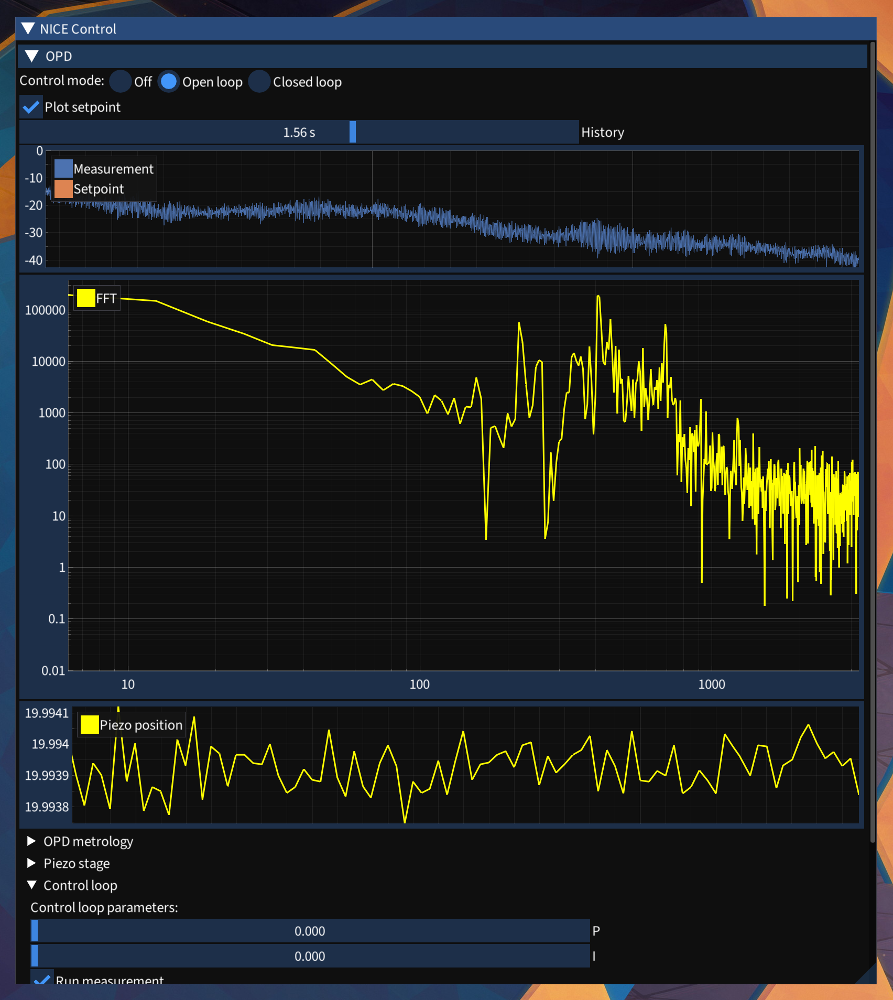

# NICEcontrol

NICEcontrol is a program to monitor and control the [Nulling Interferometry Cryogenic Experiment (NICE)](https://quanz-group.ethz.ch/research/instrumentation/nice.html).

This nulling testbed, built at ETH Zürich by the [Exoplanets & Habitability group](https://quanz-group.ethz.ch/), will demonstrate the feasibility of the [LIFE space mission](https://life-space-mission.com/).



## Architecture

Each directory in the source tree holds one kind of file.

| Directory         | Holds                                                                                  |
| ----------------- | -------------------------------------------------------------------------------------- |
| `src/core/`       | The cycle, the whiteboard, the blackboard, and the command box                         |
| `src/apps/`       | One application for each piece of hardware that the core steers                        |
| `src/devices/`    | The adapters to the outside world: ADS, Tango, and the piezo controller libraries      |
| `src/data/`       | The data types that travel between the directories, and the containers that carry them |
| `src/algorithms/` | Computation with no hardware and no state of its own: filters, FFT, controllers        |
| `src/gui/`        | The user interface                                                                     |
| `client/`         | The header that gives the distributed clock to the other programs on this PC           |

An include gives the path from `src/`, for example `#include "core/Whiteboard.hpp"`.
A vendor header gives the path from the project root, for example `#include "lib/implot/implot.h"`.

`Core` runs on one thread at a fixed cycle period of 10 ms and is independent of the user interface.
Each cycle runs three steps in order.
In `sense`, every application reads its hardware and writes what it found on the whiteboard.
In `plan`, every application decides what it wants.
In `act`, every application sends its commands to its own hardware, so each actuator takes at most one command per cycle.

An application is a small class in `src/apps/` that owns one piece of hardware.
The core steers the modes and leaves the details to the applications.

The whiteboard is the public data.
It has sample streams, which any number of readers subscribe to once and drain at their own pace, and a state of the latest values, which the core publishes as a snapshot after each cycle.
The blackboard is the private data, for what only the log and the user interface need.

Commands reach the core through one command box.
A command that holds a value takes effect when the value differs from the one the core last sent to the hardware.
A command that triggers an action carries a counter, and the core acts when the counter changes.

The user interface never touches hardware.
It reads the snapshot, it drains the streams into its plot buffers, and it writes commands.
The program keeps running with no user interface open.

### Extremum seeking

`ExtremumSeeker` looks for the input of a plant where a measurement is the smallest or the largest.
Something adds a sine to the input of the plant, and the measurement follows that sine.
The first harmonic of the measurement is the gradient of the measurement against the input, and a PI controller drives it to zero.
The class knows no hardware, thus one seeker fits any pair of a measurement and a plant input.

`OpdSeekerApp` is the seeker of the OPD: it makes one photometry region as dark as it can by moving the OPD setpoint, and the PLC dithers the command of the delay line.
A seeker of another pair is another application of that shape.

The dither carries a period in whole nanoseconds, and its phase counts from the epoch of the clock.
The PLC and the PC then compute the same phase from the same timestamp, at any frequency and for all time.
A frequency in a float would not do that, because the two sides round the division to a period differently, and one nanosecond of difference grows into many turns of phase over the size of the timestamp.

### The distributed clock for other programs

The esd card gives the distributed clock (DC) of the EtherCAT bus to one process only, thus no second program can read it from the card.
NICEcontrol writes the step from `CLOCK_MONOTONIC` to the two clocks into `/dev/shm/nice_clock` in each cycle, and `client/nice_clock.h` adds that step to a reading of `CLOCK_MONOTONIC`.
That clock has one epoch for all processes of a boot, thus the two programs speak about the same instant.

```c
int64_t t_DC_ns;
if (nice_clock_now(&t_DC_ns, NULL, NULL) == 0) use(t_DC_ns);
```

The record appears only while NICEcontrol has confidence in the offset, and the reader gives the age of the record, which the caller judges against its own budget.
The record carries no rate, thus the error grows by about 50 us in each second of age: a record younger than 200 ms gives t_DC within 10 us of the bus.
Each failure prints one line to stderr.
The offset holds for 60 s after the last pair of the two clocks, because the rate of the last estimate removes the difference of the two crystals.
`make nice-clock-read` builds a program that prints the present record, for a check from a shell.

## Install

### Prerequisites

- Install libraries

  ```bash
  sudo add-apt-repository ppa:berndporr/dsp # for iir1 (https://github.com/berndporr/iir1)
  sudo apt-get install libglfw3-dev libfftw3-dev iir1-dev python3-venv
  ```

- (Obsolte) Install the piezo controller drivers from [MCL](http://www.madcitylabs.com/) (ask their support for the files)

- Install the [Physikinstrumente](https://www.physikinstrumente.de/de/) piezo controller drivers.

  - Obtain the software bundle from PI, referred to as `PI_C-990_CD1/` in the following.
    The files can be downloaded from the PI website or found on the installation CD that came with the stage.

  - Install the PI GCS2 C++ library

    ```sh
    cd ~/Downloads/PI_C-990_CD1/Linux/
    tar -xvf PI_Application_Software-1.18.1.0-INSTALL.tar.bz2
    cd pi-drivers/Linux/PI_Application_Software
    sudo ./INSTALL
    ```

    This should install, among other things, the `lipi_pi_gcs2.so` library

  - Copy some header files into `NICEcontrol`:

    ```sh
    cd ~/code/NICEcontrol
    mkdir lib/pi
    cp ~/Downloads/PI_C-990_CD1/Development/C++/Samples/E-727/AutoZeroSample/AutoZeroSample.h lib/pi/
    cp ~/Downloads/PI_C-990_CD1/Linux/PI_Application_Software/libpi_pi_gcs2_x86_64/include/PI_GCS2_DLL.h lib/pi/
    ```

  - Comment out the line `#include <windows.h>` in `lib/pi/AutoZeroSample.h`

  - Restart the computer.

- Install the piezo controller drivers from [nanoFaktur](https://www.nanofaktur.com/support).

  - The files can be found on their support website, and the password is on the calibration certificate of the controller. You can also ask their support for the password. The installation instructions they provide are not best practice, so instead you may want to follow the instructions here:

  - Locate `libnF_interface.so` and install it as a library. By default:

    ```bash
    sudo cp ~/Downloads/EBx-120\ Support/software/lib/linux/libnF_interface_x64.so /usr/local/lib/
    sudo ldconfig
    ```

  - Copy the header files (`nF_common.h`, `nF_error.h`, `nF_interface.h`) to the lib directory:

    ```bash
    cd ~/code/NICEcontrol/
    mkdir lib/nF
    cp ~/Downloads/EBx-120\ Support/software/programming_examples/c-testLinuxLib/include/* lib/nF/
    ```

    In `nF_interface.h`, add the line `#define LINUX` at the beginning

- Install the [Beckhoff ADS library](https://github.com/Beckhoff/ADS) to communicate with the PLC:

  ```sh
  git clone https://github.com/Beckhoff/ADS.git
  cd ADS
  ```

  In the `meson.build`, delete the lines

  ```txt
  'AdsLib/TwinCAT/AdsDef.h',
  'AdsLib/TwinCAT/AdsLib.h',
  'AdsLib/standalone/AdsDef.h',
  'AdsLib/standalone/AdsLib.h',
  ```

  and add the lines

```txt
  install_headers(
    'AdsLib/standalone/AdsDef.h',
    'AdsLib/standalone/AdsLib.h',
    subdir: 'AdsLib/standalone'
  )

  install_headers(
    'AdsLib/TwinCAT/AdsDef.h',
    'AdsLib/TwinCAT/AdsLib.h',
    subdir: 'AdsLib/TwinCAT'
  )
```

Reason: cannot use `AdsSetLocalAddress` otherwise.
The default installation of the library overwrites the TwinCAT headers with the standalone ones, which do not have the `AdsSetLocalAddress` function.
Probably a bug in the `meson.build` file of the library.

Then, compile and install the library:

```sh
meson setup build
ninja -C build
sudo meson install -C build
sudo ldconfig
```

### NICEcontrol

Clone the `NICEcontrol` repository and its submodules

```bash
git clone --recurse-submodules https://github.com/thomabir/NICEcontrol
```

## Compile

```bash
cd ~/code/NICEcontrol
make
```

## Use

```bash
./bin/NICEcontrol
```

## Debugging with Analog Discovery 2

#### The distributed clock for other programs

The esd card gives the distributed clock (DC) of the EtherCAT bus to one process only, thus no second program can read it from the card.
NICEcontrol writes the step from `CLOCK_MONOTONIC` to the two clocks into `/dev/shm/nice_clock` in each cycle, and `client/nice_clock.h` adds that step to a reading of `CLOCK_MONOTONIC`.
That clock has one epoch for all processes of a boot, thus the two programs speak about the same instant.

```c
int64_t t_DC_ns;
if (nice_clock_now(&t_DC_ns, NULL, NULL) == 0) use(t_DC_ns);
```

The record appears only while NICEcontrol has confidence in the offset, and the reader gives the age of the record, which the caller judges against its own budget.
The record carries no rate, thus the error grows by about 50 us in each second of age: a record younger than 200 ms gives t_DC within 10 us of the bus.
Each failure prints one line to stderr.
The offset holds for 60 s after the last pair of the two clocks, because the rate of the last estimate removes the difference of the two crystals.
`make nice-clock-read` builds a program that prints the present record, for a check from a shell.

## Install

Download the [Adept 2 Runtime](https://digilent.com/reference/software/adept/runtime-previous-versions) (64 bit `.deb` file).
Download [Digilent WaveForms](https://digilent.com/reference/software/waveforms/waveforms-3/previous-versions) (64 bit `.deb` file).

Install their dependencies and the `.deb` files:

```bash
# sudo apt-get install libqt5multimedia5-plugins libqt5scripttools5 libqt5network5 libqt5serialport5
sudo dpkg -i ~/Downloads/digilent.adept.runtime_2.16.6-amd64.deb
sudo dpkg -i ~/Downloads/digilent.waveforms_3.23.4_amd64.deb
```

### Use

- Open WaveForms, and open the `teensy-spi.dwf3work` file.
- The waveforms shown by default are the data output of the ADCs, which are fed into the FPGA.

## Teensy to activate ADCs

#### The distributed clock for other programs

The esd card gives the distributed clock (DC) of the EtherCAT bus to one process only, thus no second program can read it from the card.
NICEcontrol writes the step from `CLOCK_MONOTONIC` to the two clocks into `/dev/shm/nice_clock` in each cycle, and `client/nice_clock.h` adds that step to a reading of `CLOCK_MONOTONIC`.
That clock has one epoch for all processes of a boot, thus the two programs speak about the same instant.

```c
int64_t t_DC_ns;
if (nice_clock_now(&t_DC_ns, NULL, NULL) == 0) use(t_DC_ns);
```

The record appears only while NICEcontrol has confidence in the offset, and the reader gives the age of the record, which the caller judges against its own budget.
The record carries no rate, thus the error grows by about 50 us in each second of age: a record younger than 200 ms gives t_DC within 10 us of the bus.
Each failure prints one line to stderr.
The offset holds for 60 s after the last pair of the two clocks, because the rate of the last estimate removes the difference of the two crystals.
`make nice-clock-read` builds a program that prints the present record, for a check from a shell.

## Install

Using PlatformIO in VSCode.

Download and install the rules for the Teensy:

```bash
cd ~/Downloads
wget https://www.pjrc.com/teensy/00-teensy.rules
sudo cp 00-teensy.rules /etc/udev/rules.d/
```

### Use

- Open the PlatformIO project in VSCode.
- Compile and upload the code to the Teensy.
- If the upload fails, press the program button on the Teensy and try again.

## License

NICEcontrol is licensed under the MIT License, see [LICENSE](LICENSE) for more information.
